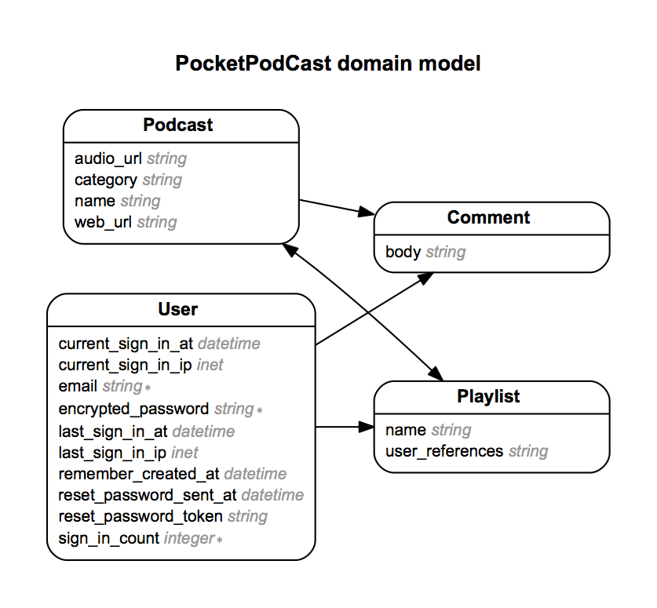

# PodCloud

## Overview
**PodCloud** is a web application to help users search for podcasts instead of using Itunes to do so. As a user signed up for the site they are able to create multiple playlists and add their selected podcasts to one of their created playlist. I built this app so it can help me listen to more podcasts because one could learn a lot from listening to many different podcasts. Podcasts are Awesome!!!

## Local Set Up
* <tt>$ git clone git@github.com:ClickClickkOnSal/PocketPodcast.git</tt>
* <tt>$ bundle install </tt>
* <tt>$ rake db:create </tt>
* <tt>$ rake db:migrate </tt>
* <tt>$ rails s </tt>

## Technologies Used

* Ruby 2.1.2
* Ruby on Rails 4.1.5
* PostgreSQL Database
* Authentication & Authorization using devise gem
* Javascript & Jquery
* Itunes API
* SASS

## User Stories
* User can signup for an account
* User can search for podcast without signing up for an account
* User can create playlists
* User can add podcasts to playlist
* User can view podcast on itunes through a link on the site

## ERD

---
Written By: Salvador Hernandez